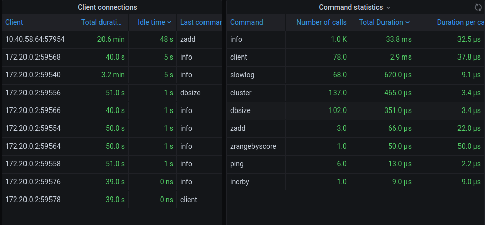
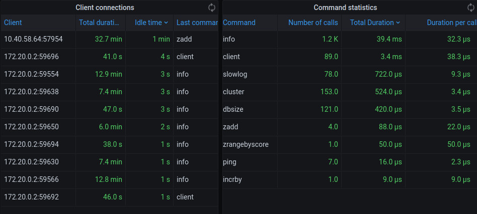

# RedisTimeOutResearch (doing)
redis time out 调研

# 打包并且打镜像
- `cd sturnus && mvn clean package -DskipTests=true`
- `docker build --build-arg JAR_FILE=sturnus-v0.1.jar -t sturnus .`
- 将`develop/docker-compose.yml`里的`REDIS_HOST`替换为您的服务器ip
- `docker-compose up -f develop/docker-compose.yml -d`

# 问题进展
线上用的redis，在压力大的会出现`RedisTimeOut`的异常，但我们的系统要求高可用 && 高性能嘛，就想着尽量避免这种情况，现在也做了本地cache，但是还是会有`RedisTimeOut`的问题存在。
  
分析了一个星期，把经历梳理了一下，并且做一个分享。

- Spring版本: `2.1.7.RELEASE`
- Redis版本: `6.0.7`
- Java的redis-client: Lettuce


我自己又单独写了一个小project来测试。redis相关的配置如下
```
spring:
  redis:
    database: 0
    host: ${REDIS_HOST:127.0.0.1}
    port: ${REDIS_PORT:6379}
    lettuce:
      pool:
        max-active: 300
        max-wait: -1
        max-idle: 100
        min-idle: 10
    timeout: 1000
```
然后用的`docker-compose`进行的部署
```
CONTAINER ID        IMAGE               COMMAND                  CREATED             STATUS              PORTS                     NAMES
3ed653397fd8        sturnus             "java -jar /usr/shar…"   3 hours ago         Up 3 hours                                    sturnus-redis-app
6e1e63a9eb34        redis:6.0.7         "docker-entrypoint.s…"   3 hours ago         Up 3 hours          0.0.0.0:12300->6379/tcp   redis
```

然后用到了`blade`模拟`redis`处理慢的问题

```
blade create docker network delay --time 930 --interface eth0 --local-port 6379 --container-id 6e1e63a9eb34
```

然后application侧打印的log如下
```
2020-09-04 20:43:17.101  WARN 1 --- [nio-8080-exec-3] o.s.d.r.c.l.LettuceConnectionFactory     : Validation of shared connection failed. Creating a new connection.
2020-09-04 20:43:17.101 ERROR 1 --- [nio-8080-exec-4] c.y.s.w.RedisController                  : add ts: 1599223394768 error, errMsg:
 
org.springframework.dao.QueryTimeoutException: Redis command timed out; nested exception is io.lettuce.core.RedisCommandTimeoutException: io.lettuce.core.RedisCommandTimeoutException: Command timed out after 1 second(s)
        at org.springframework.data.redis.connection.lettuce.LettuceExceptionConverter.convert(LettuceExceptionConverter.java:70) ~[spring-data-redis-2.1.10.RELEASE.jar!/:2.1.10.RELEASE]
        at org.springframework.data.redis.connection.lettuce.LettuceExceptionConverter.convert(LettuceExceptionConverter.java:41) ~[spring-data-redis-2.1.10.RELEASE.jar!/:2.1.10.RELEASE]
        at org.springframework.data.redis.PassThroughExceptionTranslationStrategy.translate(PassThroughExceptionTranslationStrategy.java:44) ~[spring-data-redis-2.1.10.RELEASE.jar!/:2.1.10.RELEASE]
        at org.springframework.data.redis.FallbackExceptionTranslationStrategy.translate(FallbackExceptionTranslationStrategy.java:42) ~[spring-data-redis-2.1.10.RELEASE.jar!/:2.1.10.RELEASE]
        at org.springframework.data.redis.connection.lettuce.LettuceConnection.convertLettuceAccessException(LettuceConnection.java:268) ~[spring-data-redis-2.1.10.RELEASE.jar!/:2.1.10.RELEASE]
        at org.springframework.data.redis.connection.lettuce.LettuceZSetCommands.convertLettuceAccessException(LettuceZSetCommands.java:903) ~[spring-data-redis-2.1.10.RELEASE.jar!/:2.1.10.RELEASE]
        at org.springframework.data.redis.connection.lettuce.LettuceZSetCommands.zAdd(LettuceZSetCommands.java:72) ~[spring-data-redis-2.1.10.RELEASE.jar!/:2.1.10.RELEASE]
        at org.springframework.data.redis.connection.DefaultedRedisConnection.zAdd(DefaultedRedisConnection.java:679) ~[spring-data-redis-2.1.10.RELEASE.jar!/:2.1.10.RELEASE]
        at org.springframework.data.redis.core.DefaultZSetOperations.lambda$add$0(DefaultZSetOperations.java:53) ~[spring-data-redis-2.1.10.RELEASE.jar!/:2.1.10.RELEASE]
        at org.springframework.data.redis.core.RedisTemplate.execute(RedisTemplate.java:224) ~[spring-data-redis-2.1.10.RELEASE.jar!/:2.1.10.RELEASE]
        at org.springframework.data.redis.core.RedisTemplate.execute(RedisTemplate.java:184) ~[spring-data-redis-2.1.10.RELEASE.jar!/:2.1.10.RELEASE]
        at org.springframework.data.redis.core.AbstractOperations.execute(AbstractOperations.java:95) ~[spring-data-redis-2.1.10.RELEASE.jar!/:2.1.10.RELEASE]
        at org.springframework.data.redis.core.DefaultZSetOperations.add(DefaultZSetOperations.java:53) ~[spring-data-redis-2.1.10.RELEASE.jar!/:2.1.10.RELEASE]
        at org.springframework.data.redis.core.DefaultBoundZSetOperations.add(DefaultBoundZSetOperations.java:59) ~[spring-data-redis-2.1.10.RELEASE.jar!/:2.1.10.RELEASE]
        at com.yitu.sturnus.web.RedisController.addZSet(RedisController.java:80) [classes!/:?]
        at jdk.internal.reflect.NativeMethodAccessorImpl.invoke0(Native Method) ~[?:?]
        at jdk.internal.reflect.NativeMethodAccessorImpl.invoke(NativeMethodAccessorImpl.java:62) ~[?:?]
        at jdk.internal.reflect.DelegatingMethodAccessorImpl.invoke(DelegatingMethodAccessorImpl.java:43) ~[?:?]
        at java.lang.reflect.Method.invoke(Method.java:566) ~[?:?]
        at org.springframework.web.method.support.InvocableHandlerMethod.doInvoke(InvocableHandlerMethod.java:190) [spring-web-5.1.9.RELEASE.jar!/:5.1.9.RELEASE]
        at org.springframework.web.method.support.InvocableHandlerMethod.invokeForRequest(InvocableHandlerMethod.java:138) [spring-web-5.1.9.RELEASE.jar!/:5.1.9.RELEASE]
        at org.springframework.web.servlet.mvc.method.annotation.ServletInvocableHandlerMethod.invokeAndHandle(ServletInvocableHandlerMethod.java:104) [spring-webmvc-5.1.9.RELEASE.jar!/:5.1.9.RELEASE]
        at org.springframework.web.servlet.mvc.method.annotation.RequestMappingHandlerAdapter.invokeHandlerMethod(RequestMappingHandlerAdapter.java:892) [spring-webmvc-5.1.9.RELEASE.jar!/:5.1.9.RELEASE]
        at org.springframework.web.servlet.mvc.method.annotation.RequestMappingHandlerAdapter.handleInternal(RequestMappingHandlerAdapter.java:797) [spring-webmvc-5.1.9.RELEASE.jar!/:5
```

整个链路是  redis-client发送请求 -> 建立connection(从connectionPools取) -> 网络传输 ->  redis中命令排队 ->  redis命令执行  ->  网络传输 -> redis-client拿到响应


现在可以通过[`blade`](https://github.com/chaosblade-io/chaosblade)工具排查应该不是client连接池的问题。

感谢 @weiyinfu 提供的思路
1. slowlog_len 大一些， 去看slowlog里面执行较慢的命令的耗时
2. 取高峰的qps， 预估命令排队的时间
3. 分析redis的大object的大小, 看是不是网络传输的时延长

接下来的排查工作，围绕网络延迟，丢包，cpu打满三个情况去测试的

- 目前的应用设置的redis的timeout是 1000ms

- 请求"/add"共执行了三种操作

    1. zadd 当前时间戳
    2. zrangebyscore 取出[ts-2000, ts]的所有时间
    3. incrby 对取得的所有的时间size进行increment

mock线上的docker容器有
```
CONTAINER ID        IMAGE                    COMMAND                  CREATED             STATUS              PORTS                    NAMES
1e94b191cdbf        sturnus                  "java -jar /usr/shar…"   20 minutes ago      Up 20 minutes                                sturnus-redis-app
3c331867f63f        redis:6.0.7              "docker-entrypoint.s…"   20 minutes ago      Up 20 minutes       0.0.0.0:6379->6379/tcp   redis
38a904d034b3        grafana/grafana:latest   "/run.sh"                20 minutes ago      Up 20 minutes       0.0.0.0:3000->3000/tcp   grafana
```
- 网络延时实验
```
mock线上对redis进行延时 800ms
blade create docker network delay --time 800 --interface eth0 --local-port 6379 --container-id 3c331867f63f
{"code":200,"success":true,"result":"98f83fcb20fe2e1d"}
 
发送请求"http://server_ip:8080/add"
查看后台log同真实线上的情况

监控截图如下图 1.1

为了进一步mock真实场景，需要减少延时试一下
先删除之前的延时
blade destroy 98f83fcb20fe2e1d
 
对redis创建延时600ms
blade create docker network delay --time 600 --interface eth0 --local-port 6379 --container-id 3c331867f63f
 
同样用sturnus进行脚本发送
得到的log同真实线上的情况
 
监控截图如图 1.2
 
继续降低时延为 500ms, redis-client还会报time out
blade create docker network delay --time 500 --interface eth0 --local-port 6379 --container-id 3c331867f63f
 
继续降低时延为100ms, redis-client还会报time out
blade create docker network delay --time 100 --interface eth0 --local-port 6379 --container-id 3c331867f63f
 
继续降低时延为5ms, redis-client还是会报time out
blade create docker network delay --time 5 --interface eth0 --local-port 6379 --container-id 3c331867f63f
 
继续降低时延为1ms, redis-client还是会报time out
blade create docker network delay --time 1 --interface eth0 --local-port 6379 --container-id 3c331867f63f
 
销毁时延后，发送请求，仅仅需要 8ms 到 12ms, 怀疑这个blade无法精确控制时延
```
- 图1.1 
- 图1.2 

- 网络丢包实验
``` 
丢包率80%
blade create docker network loss --interface eth0 --percent 80 --container-id 3c331867f63f
 
丢包情况下，也会得到同样的线上的log
```


- <del> cpu打满实验 </del>
```
blade create docker cpu fullload --cpu-percent 100 --container-id 3c331867f63f

cpu打满情况下，app能成功拿到redis的数据. 去除此种情况
```

- key信息获取
```
redis-cli --bigkeys
# Scanning the entire keyspace to find biggest keys as well as
# average sizes per key type.  You can use -i 0.1 to sleep 0.1 sec
# per 100 SCAN commands (not usually needed).

[00.00%] Biggest set    found so far '"1599132285379:mills"' with 1 members
[00.07%] Biggest set    found so far '"1599137644259:mills"' with 2 members
[00.14%] Biggest set    found so far '"1599131702663:mills"' with 4 members
[01.53%] Biggest set    found so far '"1599139819737:mills"' with 5 members
[11.42%] Biggest set    found so far '"1599139809653:mills"' with 6 members
[31.79%] Biggest string found so far '"zsetSize"' with 3 bytes
[64.79%] Biggest zset   found so far '"mills_key"' with 1541289 members
[64.89%] Sampled 1000000 keys so far
[88.58%] Biggest string found so far '"listSize"' with 7 bytes

-------- summary -------

Sampled 1541062 keys in the keyspace!
Total key length in bytes is 29280146 (avg len 19.00)

Biggest string found '"listSize"' has 7 bytes
Biggest    set found '"1599139809653:mills"' has 6 members
Biggest   zset found '"mills_key"' has 1541289 members

0 lists with 0 items (00.00% of keys, avg size 0.00)
0 hashs with 0 fields (00.00% of keys, avg size 0.00)
2 strings with 10 bytes (00.00% of keys, avg size 5.00)
0 streams with 0 entries (00.00% of keys, avg size 0.00)
1541059 sets with 1542417 members (100.00% of keys, avg size 1.00)
1 zsets with 1541289 members (00.00% of keys, avg size 1541289.00)
```
- debug object
```
redis-cli> debug object mill_keys
Value at:0x7f3656ef9840 refcount:1 encoding:skiplist serializedlength:33908363 lru:5442738 lru_seconds_idle:389
```

## Useful Link
- [grafana redis monitor](https://github.com/RedisTimeSeries/grafana-redis-datasource)
- [分析redis的key](https://blog.csdn.net/qmhball/article/details/86063466)